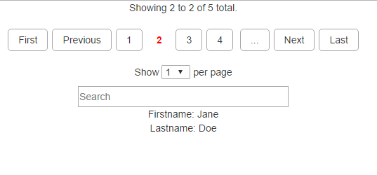

# simplePaging
Simple, easy to customize paging system using jQuery. 

## Features
1. Custom templates for the data
2. Easy to style paging system
3. Custom error template
4. Uses JSON data to populate data and pager
5. Custom event that is fired when anything happens in the pager

## How to use
Simply download the simplePaging.js file and reference it in your code. Make sure to put this under the jQuery reference as this requires jQuery to function properly.

To call the paging you will want to set up some html first.

The quickest way will be with using `
` tags.

~~~

~~~

You can use any container for holding the pager and content.

For this example we will be using this data:

~~~
var data = [{"firstname":"John","lastname":"Smith"},
            {"firstname":"Jane","lastname":"Doe"},
            {"firstname":"James","lastname":"Smith"},
            {"firstname":"Amanda","lastname":"Doe"},
            {"firstname":"Billy","lastname":"Joe"}];
~~~

Once you have this set up you will want to set up your data template. 
This will be how the data is displayed to the user. You can use a table, bootstrap cols, or whatever you like.

~~~

~~~

This will simply show the firstname and lastname from the data specified above.

If you want to specifiy an error template to match your data you can create one using the same method from above.

~~~

~~~

This is optional. If you don't give an error template a simple one is created for you.

Next will be initalizing the paging system for this data. There are plenty of options for making sure that you have the right set up for your data.

~~~
$('#pager').paging({
  data: data,   //This is the data that is being used. It is using JSON data so you can pull from any source if you want.
  contentHolder: 'content',   //The id for the area where you want the data to be displayed.
  template: 'contentTemplate',    //The template that is being used to display the data.
  errorTemplate: 'contentErrorTemplate',    //The error template that is being used (optional)
  informationToShow: ['firstname', 'lastname'],   //The information that you want to show from the given data
  informationToRefineBy: ['firstname', 'lastname'],   //The information that you want to search on from the given data
  perPage: 1,   //Default number to show per page. (Since we have a small amount of data only show 1.)
  pageLengths: [1, 2, 3, 4],  //Options for number of items per page.
  startPage: 1,   //The default start page. (Better to leave as 1 but can be changed if desired).
  pagesToShow: 5,   //Number of pages to show at the top. If you have 10 pages it will show [...] when going above or below the this number.
  showOptions: true,    //Show the per page options.
  showSearch: true,   //Show the search bar.
  alwaysShowPager: true   //Show the pager even if there isn't any data. Should be true if showSearch is true otherwise there will be problems.
});
~~~

To give a more in depth explination of these elements.

`data` - This is the data that is wanting to be displayed. You can use JSON from any source for this but it needs to be JSON.  
`contentHolder` - This is the `id` for the container that will hold all the data once it has been applied to the template.  
`template` - This is the template that is being used to display the data. We created two above. One for the data and one for the error.  
`errorTemplate` - This is what is shown if there is no data to display. If you do not supply one there is a generic one that will fill in the area.  
`informationToShow` - This is the information from the data given that you want to display. In our example the template has {0} and {1}. These will corrospond to `firstname` and `lastname` respectively. The order in the array will matter for what is displayed in each location.  
`informationToRefineBy` - This is the information that the search will use to refine by. In our case we want to search on the `firstname` and `lastname` columns from the data.  
`perPage` - Default number of items to show per page. We are using a small amount of data so 1 per page will do for default.  
`pageLengths` - This will be a drop down that will give options for the possible number of items to display per page.  
`startPage` - This is what page you want to start on for your pager. The defualt is 1 which recommended but the option is there incase you want to change it.  
`pagesToShow` - This is the number of pages to show in the pager at any point in time. If you have 100 pages of content this will only show the number of specified pages at a time. A simple [...] will be displayed before and after the are of pages that are being shown.   
`showOptions` - Shows the per page options drop down.  
`showSearch` - Shows the search bar.  
`alwaysShowPager` - Shows the pager even if there isn't any data to show. The only time this really applies is when you have the search bar shown. If they search and find no results we want to make sure that they can delete what they typed in without needing to refresh the page.  

Once you have all this put together you will get the follow display:

